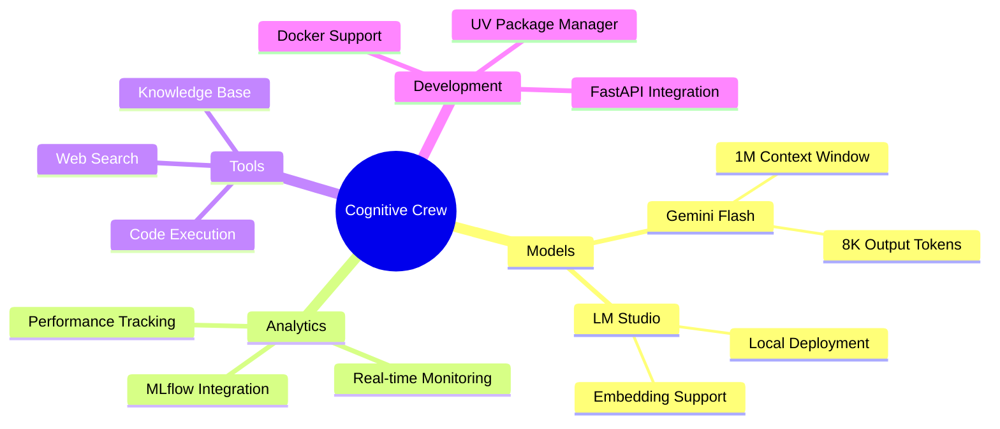
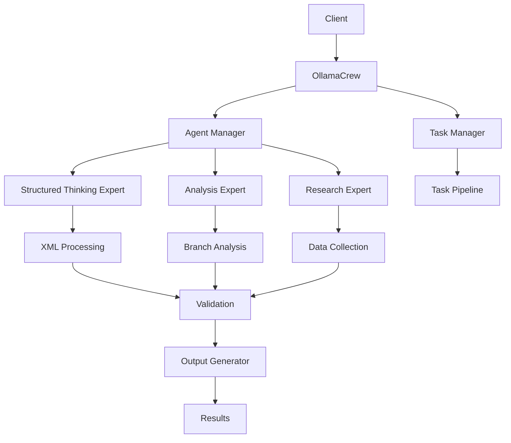
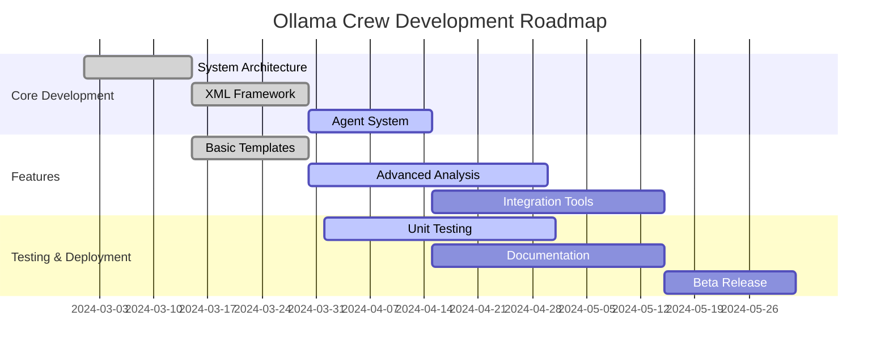
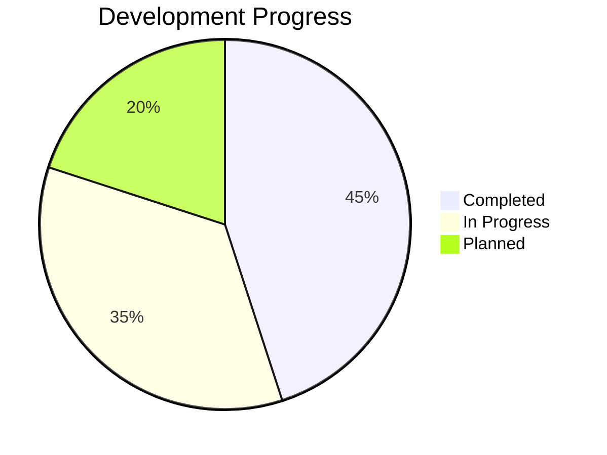
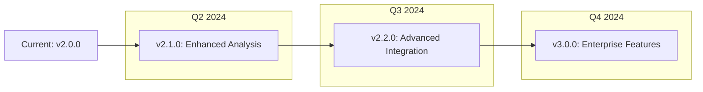
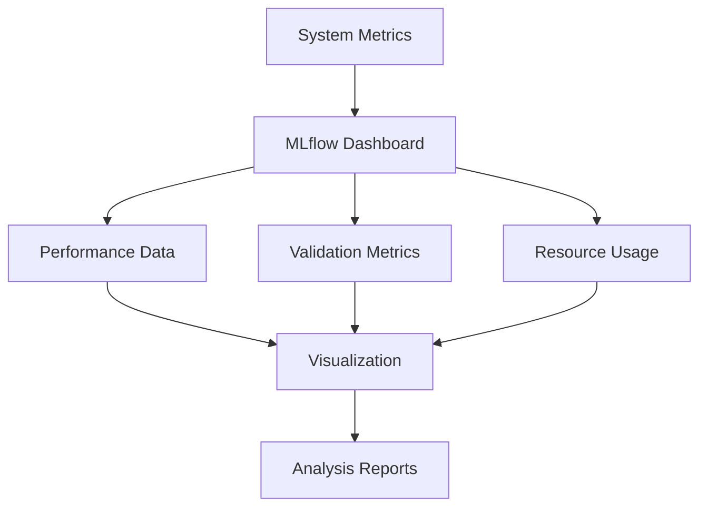
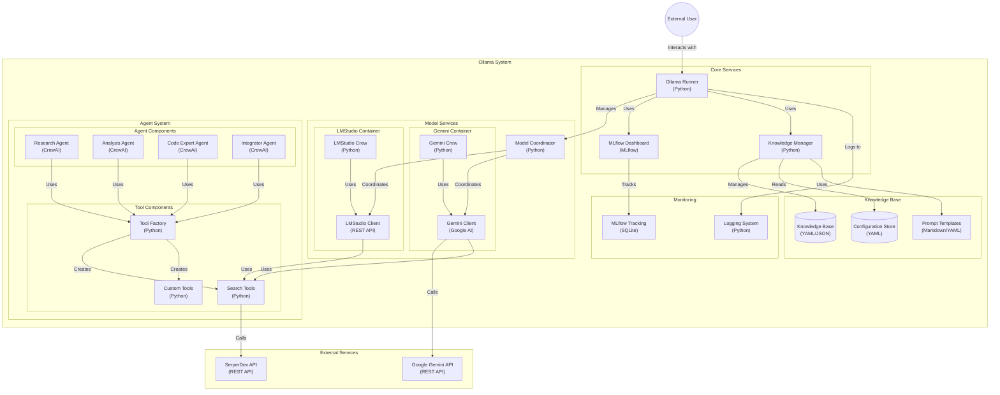

<div align="center">

# Cognitive Crew AI Framework

> Next-Generation Enterprise AI System with Advanced Model Integration and MLflow Analytics

[Features](#-core-features) •
[Installation](#-quick-start) •
[Documentation](#-documentation) •
[Contributing](#-contributing)

[](https://www.python.org/)
[](https://mlflow.org)
[](https://www.postgresql.org/)
[](https://ai.google.dev/)
[](https://langchain.com)
[](https://python.langchain.com/docs/langgraph)
[](https://www.crewai.com/)
[](https://www.selenium.dev/)
[](https://www.docker.com/)
[](https://fastapi.tiangolo.com/)
[](https://docs.astral.sh/uv/)
[](https://docs.pytest.org/)
[](https://black.readthedocs.io/)
[](https://beta.ruff.rs/docs/)
[](https://www.mkdocs.org/)
[](LICENSE)

</div>

## Table of Contents

- [Overview](#-overview)
- [Core Features](#-core-features)
- [System Architecture](#-system-architecture)
  - [Model Integration](#-model-integration)
  - [Tool Integration](#-tools-integration)
  - [Analytics Pipeline](#-performance-monitoring)
- [Installation](#-quick-start)
  - [Prerequisites](#-quick-start)
  - [Quick Start](#-quick-start)
  - [Docker Deployment](#-quick-start)
- [Usage](#-usage)
  - [Basic Usage](#-usage)
  - [Advanced Configuration](#-configuration)
  - [Model Selection](#-model-integration)
- [Configuration](#-configuration)
  - [Environment Variables](#-configuration)
  - [Model Settings](#-configuration)
  - [MLflow Setup](#-configuration)
- [Development](#-contributing)
  - [Code Quality](#-contributing)
  - [Testing](#-contributing)
  - [Documentation](#-documentation)
- [Monitoring](#-performance-monitoring)
  - [MLflow Dashboard](#-performance-monitoring)
  - [Performance Metrics](#-performance-monitoring)
  - [Alerting](#-performance-monitoring)
- [Contributing](#-contributing)
  - [Development Setup](#-contributing)
  - [Pull Request Process](#-contributing)
- [Support](#-support)
  - [Documentation](#-documentation)
  - [Community](#-support)
  - [Professional Support](#-support)
- [License](#-license)
- [Acknowledgments](#-acknowledgments)

## Overview

Cognitive Crew AI is an enterprise-grade framework for orchestrating multiple AI models with advanced analytics and monitoring capabilities. It supports Gemini Flash (1M context), LM Studio, and provides extensive tooling for development and deployment.

## Core Features



## Quick Start

```bash
# Install using UV
uv venv
uv pip install -r requirements.txt

# Configure Environment
cp .env.example .env

# Start MLflow Server
docker-compose up -d mlflow

# Run System
python -m src.ollama.main run
```

## Model Integration

| Model | Context | Output | Features |
|-------|----------|---------|-----------|
| Gemini Flash | 1M tokens | 8K tokens | Code, Search, Tools |
| LM Studio | 4K tokens | 2K tokens | Local, Embeddings |

## System Architecture



## 📅 Project Timeline



## 📊 Project Progress

Current Status: Beta Development (v2.0.0)



### Milestone Progress

- [x] Core Architecture (100%)
- [x] XML Framework (100%)
- [x] Basic Templates (100%)
- [ ] Advanced Analysis (75%)
- [ ] Integration Tools (45%)
- [ ] Testing Suite (60%)
- [ ] Documentation (40%)

## 🔮 Future Roadmap



### Upcoming Features

1. **Q2 2024 (v2.1.0)**
   - Advanced pattern recognition
   - Enhanced error recovery
   - Performance optimization

2. **Q3 2024 (v2.2.0)**
   - Custom model integration
   - Distributed processing
   - Real-time analytics

3. **Q4 2024 (v3.0.0)**
   - Enterprise security features
   - Advanced monitoring
   - Cloud deployment options

## 📊 Performance Monitoring



### Key Metrics

- Execution Performance
- Memory Utilization
- Success Rates
- Validation Scores
- Resource Efficiency

### Dashboard Features

- Real-time Monitoring
- Custom Metric Tracking
- Performance Alerts
- Resource Optimization
- Trend Analysis

## 🛠 Configuration

### Agent Configuration

```yaml
structured_thinking_expert:
  role: "Analytical Thinking Architect"
  goal: "Generate well-organized thought processes"
  tools: ["template_validation", "branch_analysis"]
```

### Task Configuration

```yaml
analysis_task:
  template: tags
  description: "Apply structured thinking to {topic}"
  agent: structured_thinking_expert
```

## 📚 Documentation

- [Configuration Guide](docs/configuration.md)
- [Template Reference](docs/templates.md)
- [API Documentation](docs/api.md)
- [Best Practices](docs/best-practices.md)

## 🤝 Contributing

We welcome contributions! Please see our [Contributing Guidelines](CONTRIBUTING.md) for details.

1. Fork the repository
2. Create your feature branch (`git checkout -b feature/amazing-feature`)
3. Commit your changes (`git commit -m 'Add amazing feature'`)
4. Push to the branch (`git push origin feature/amazing-feature`)
5. Open a Pull Request

## 💬 Support

- 📚 [Documentation](https://docs.crewai.com)
- 💬 [Discord Community](https://discord.gg/X4JWnZnxPb)
- 🤝 [GitHub Issues](https://github.com/joaomdmoura/crewai/issues)
- 💡 [Documentation Chat](https://chatg.pt/DWjSBZn)

## 📜 License

This project is licensed under the MIT License - see the [LICENSE](LICENSE) file for details.

## 🙏 Acknowledgments

- [crewAI](https://crewai.com) for the core framework
- The open-source community for valuable tools and libraries
- Contributors who have helped shape this project

## 📋 Changelog

See [CHANGELOG.md](CHANGELOG.md) for version history and updates.


